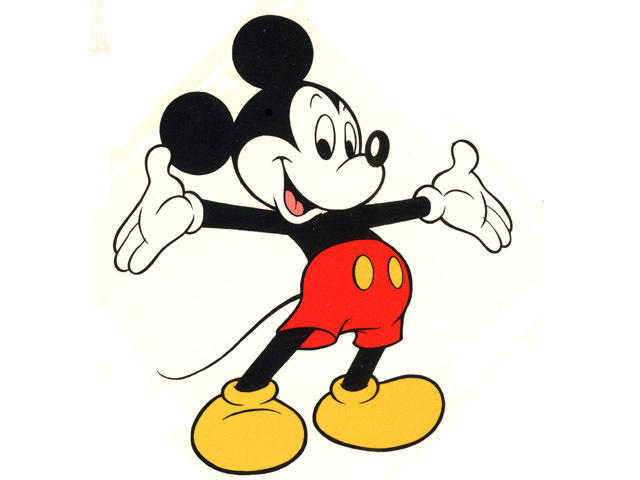

# Merging images using weighted addition!

images can be merged together provided they have the same dimensions, if
the dimensions is diffent, one of the images needs to be resized to the 
size of the other before addition. the merging is done using weighted addition
in this function each image has a weight of 0-1 associated with it, and the 
weight denotes the prominance of the image in the merged image

## Image 1:  
  
## Image 2:  
  
## Substracted Image:  
  
