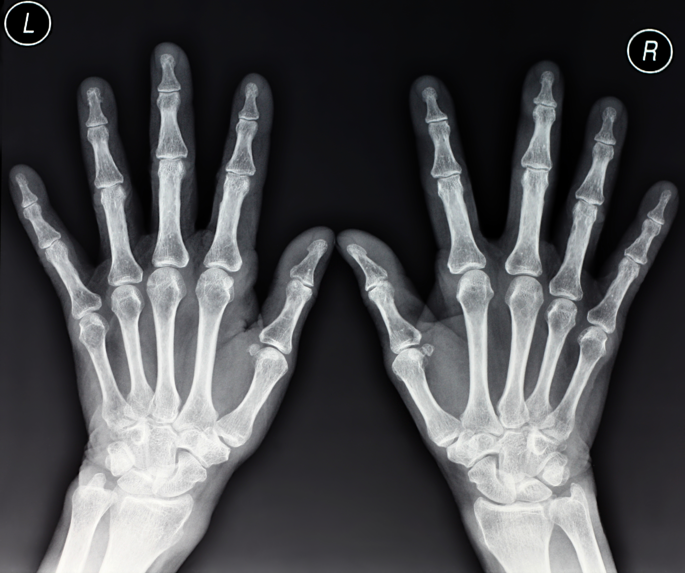
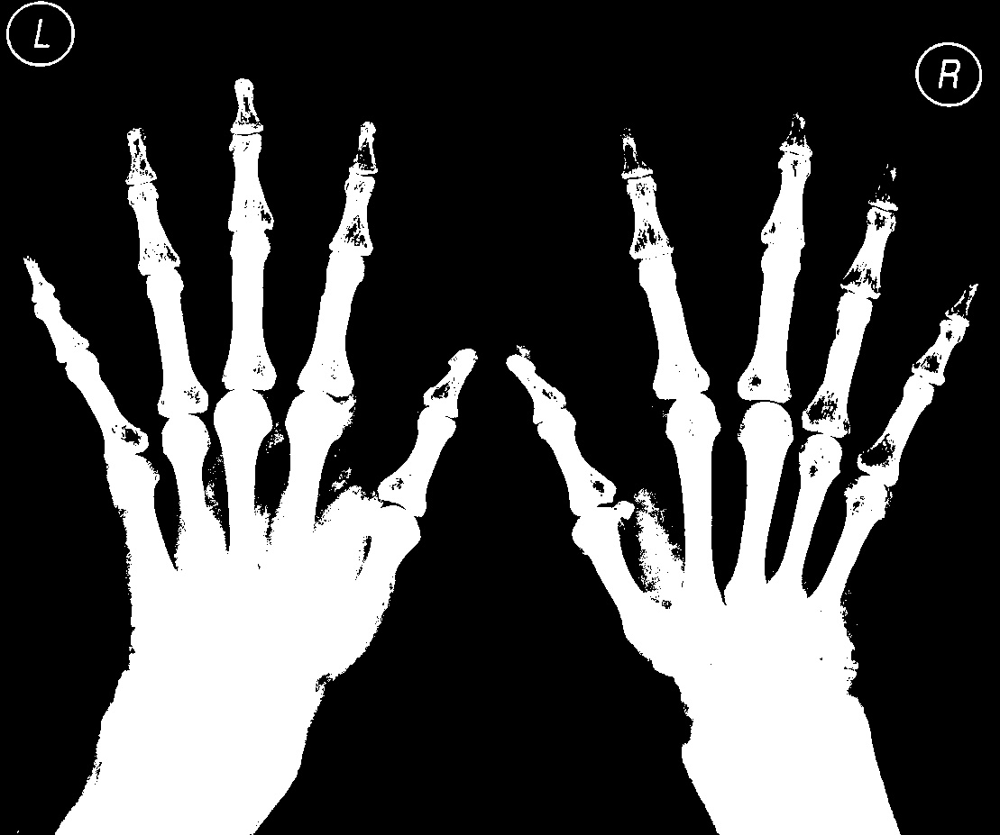

# image segmentation using thresholding.

## image segmentation is the procress of subdividing an image into disjoint regios of intrest for further analysis.

## Raw image:-

## segmented image:-

