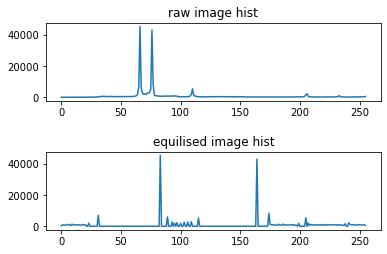

# histogram equlization
histogram equilization is a method to adjust the contrast of a image using a images histogram
the method usually increases the global contrast of images. it allows for areas of lower local
contrast to gain higher contrast.this metod can be used to better visualise bone structures from
x ray images, thermal, satellite images etc

-----------------------------------------------------------------------------------------------------
  ### Raw Image
   
  
  ### Histogram Equalised Images
    
  
  ### Histogram
   
  
-----------------------------------------------------------------------------------------------------
