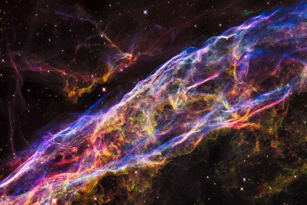

# Image Arithmethic in OpenCV

## Image Addition:-
Image addition is the procress of superimposing an image on top of another.
It can be done in two methods:- 
### 1. Weighted Addition:-  
	in this method of addition, a weight is associated with it that will denote
	its significance in the final image. The weight lies between 0 and 1.  
	Python code to perform weighted addition:-  
**OPImage = cv2.addWeighted(img1, weight1, img2, weight2, gamma)**

### 2. Non Weighted Addition:-  
	In this method of addition, both images has a 0.5 weight associated with it
	i.e. both image will have equal significance in the output image.
	Python code to perform non weighted addition:-  
**OPImage = cv2.add(img1, img2)**			
				
#### Image One:-

#### Image Two:-

#### Weighted Addition Results:-

#### Non Weighted Addition Results:-

